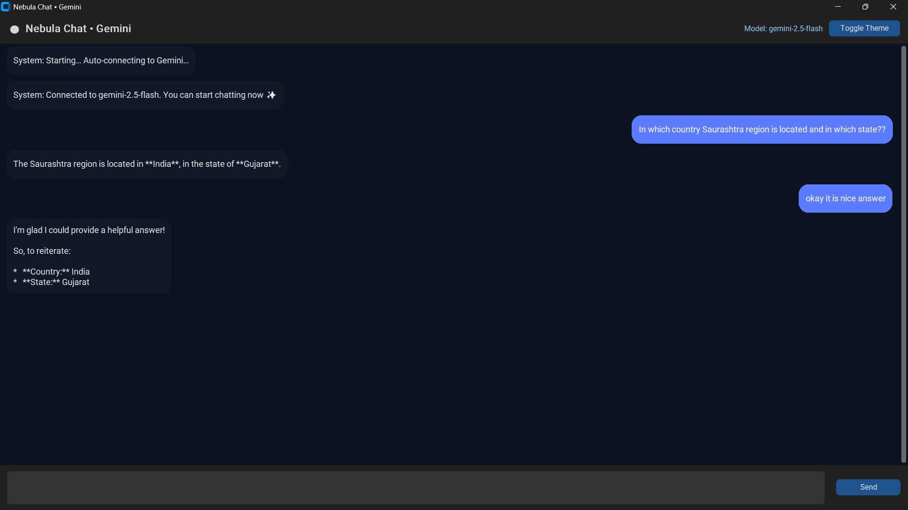

# 📘 Nebula Chat (Gemini GUI)

---

## 🚀 Nebula Chat • Gemini (Python GUI AI Chatbot)

Nebula Chat is a modern, ChatGPT/Gemini-style AI assistant built in **Python** using:

- **CustomTkinter**
- **Google Gemini 2.5 Flash / Pro models**
- **Auto-connect using `.env`**
- **Typing animations & chat bubbles**
- **Dark/Light themes**

The app runs instantly and only requires your **Google AI API key**.

---

## 🌟 Features

### 👍 Modern Look (ChatGPT/Gemini inspired UI)
- Rounded chat bubbles
- Smooth dark/light mode
- Auto-scroll
- Typing animation

### ⚙️ Smart Gemini Connection
- Auto-connect on startup
- Reads API key from `.env` (no need to type it!)
- Smart fallback model selection

### 💬 Smooth Chat Experience
- Enter to send
- Shift+Enter = new line

---

## 🔑 How to Get Your Google Gemini API Key

Follow these simple steps:

### 1️⃣ Visit Google AI Studio

Go to:

👉 https://aistudio.google.com/app/apikey

### 2️⃣ Sign in with a Google Account

Any Gmail account works — no credit card required.

### 3️⃣ Click the “Create API Key” button

Google will instantly generate your key.

### 4️⃣ Copy the API key

You will see something like:
AIzaSyB......yourkey......xkY

### 5️⃣ Paste the key into your `.env` file (next section)

---

## 📁 Where to Put the API Key — VERY IMPORTANT

Create a file named:

```bash
.env
```

in the same folder as your `chatbot.py` file.

Put your API key inside like this:

```ini
GEMINI_API_KEY=your_real_api_key_here

# Optional:
# GEMINI_MODEL=gemini-2.5-pro
```

Example:

```ini
GEMINI_API_KEY=AIzaSyAbCdEfGh123456-YourKey-Example
```

That’s it — the app will auto-connect without asking anything.

---

## 🛠️ Installation

Install required packages:

```bash
pip install -U customtkinter google-generativeai python-dotenv
```

---

## ▶️ Running the App

```bash
python chatbot.py
```

The app will automatically:

* ✔️ Load your API key from `.env`
* ✔️ Connect to Gemini
* ✔️ Start chatting instantly

---

## 🧠 Example Chat

**You:**

> In which country Saurashtra region is located and in which state?

**Bot:**

> The Saurashtra region is located in **India**, in the state of **Gujarat**.

---

## 🖼️ UI Preview

```markdown

```

(Place your screenshot as `images/ui.png` if using GitHub)

---

## ⚙️ Supported Models (Automatically handled)

* `gemini-2.5-flash` (default)
* `gemini-2.5-pro`
* Legacy fallback:

  * `gemini-1.5-flash`
  * `gemini-1.5-pro`

The app selects the best available model supported by your API key.

---

## 📌 Requirements

* Python 3.9+
* Google Gemini API key
* Internet connection
* Packages:

  * `customtkinter`
  * `google-generativeai`
  * `python-dotenv`

---

## ❤️ Credits

Developed with love — modern UI inspired by ChatGPT & Google Gemini UIs.
